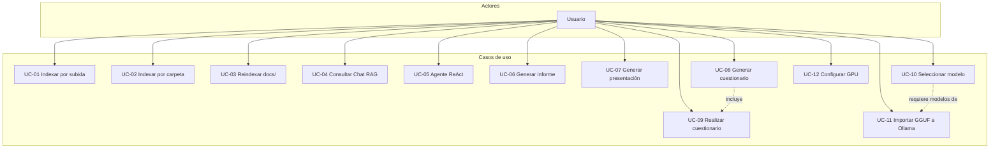
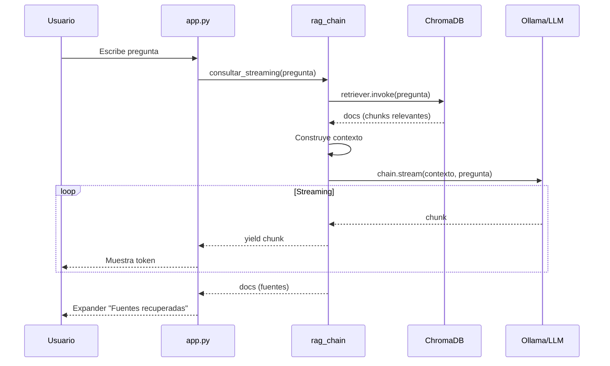
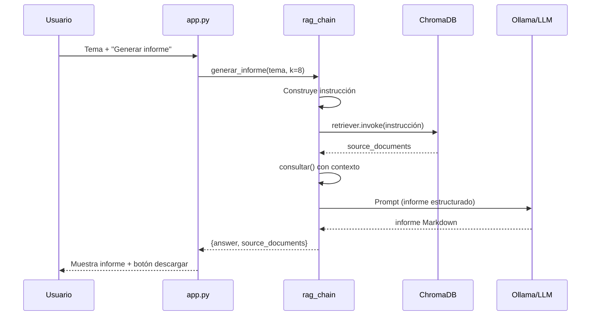
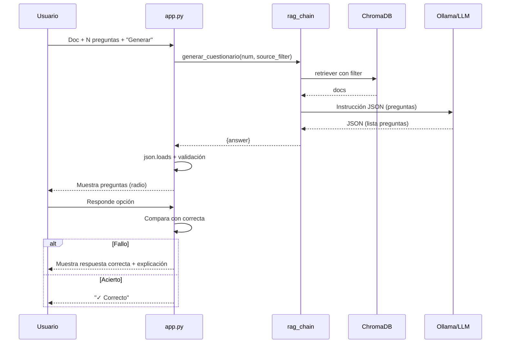
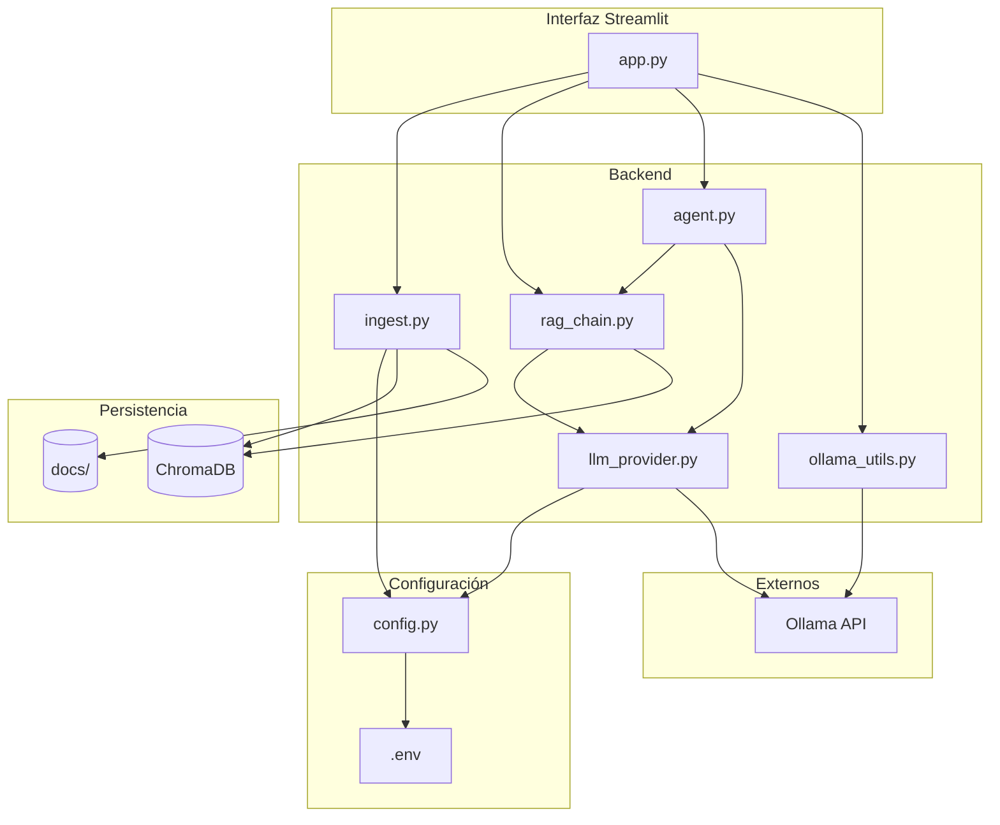
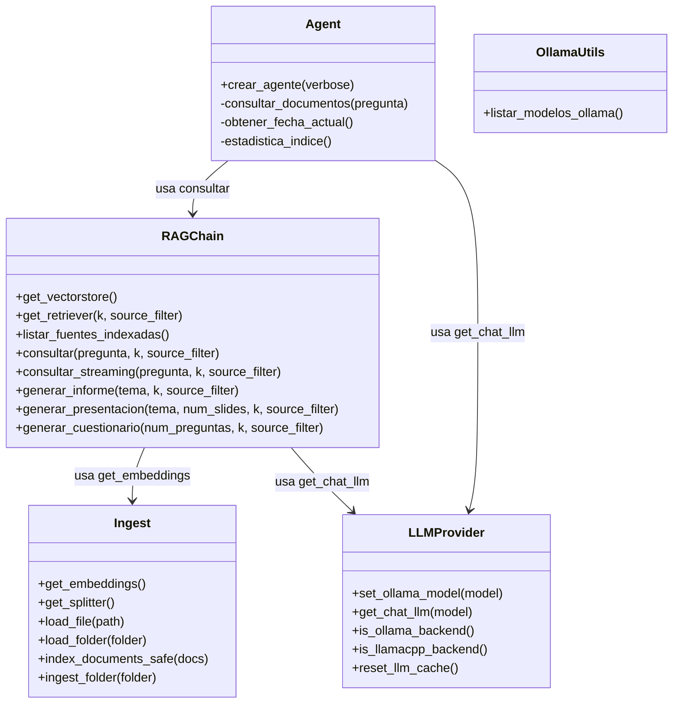
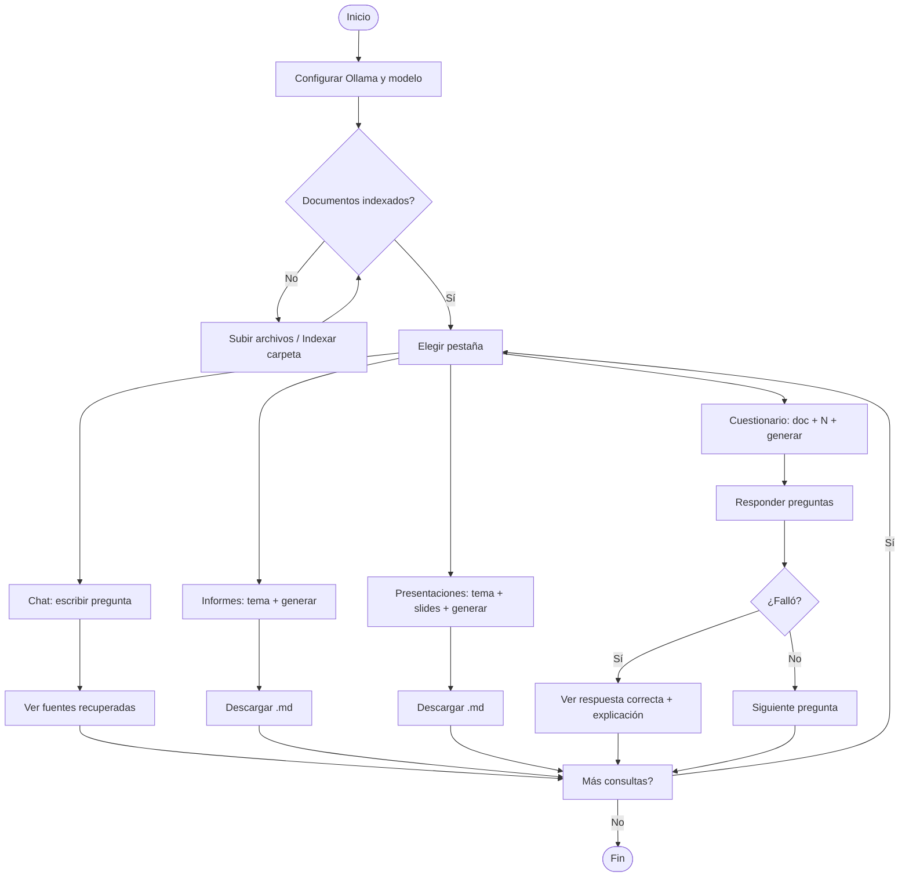
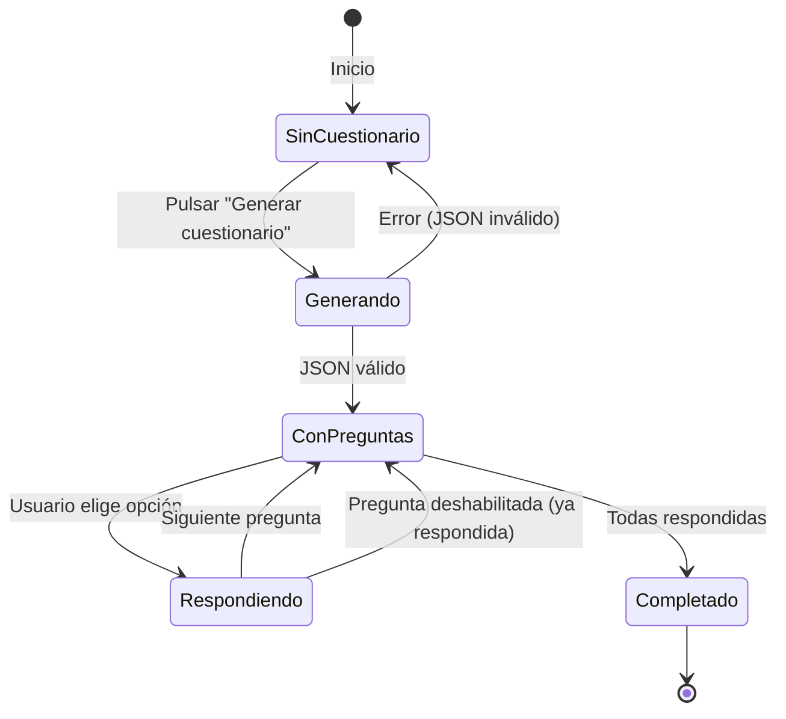
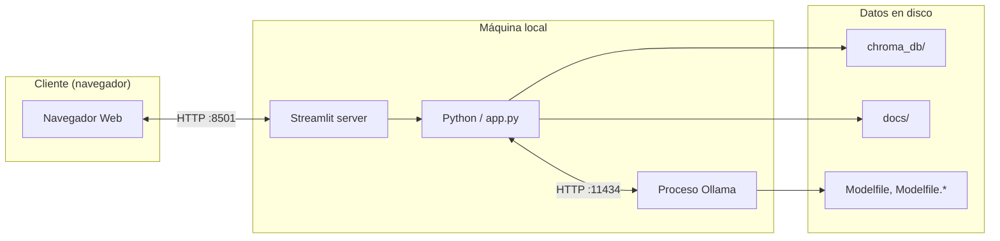

# Especificación de Casos de Uso y Diagramas UML

**Versión:** 1.0  
**Fecha:** Marzo 2025

Los diagramas están en formato **Mermaid** y pueden visualizarse en editores compatibles (VS Code, GitHub, GitLab, Obsidian, etc.) o en [mermaid.live](https://mermaid.live).

---

## 1. Actores

| Actor | Descripción |
|-------|-------------|
| **Usuario** | Usuario final que utiliza la aplicación web para indexar documentos, consultar, generar informes, presentaciones o cuestionarios. |
| **Sistema** | La aplicación RAG local (Streamlit + backend). |

---

## 2. Casos de uso

### UC-01: Indexar documentos por subida

| Campo | Descripción |
|-------|-------------|
| **Actor** | Usuario |
| **Precondiciones** | La aplicación está ejecutándose. |
| **Flujo principal** | 1. El usuario selecciona uno o más archivos (PDF, TXT, DOCX) con el selector de archivos. 2. Pulsa «Indexar los archivos seleccionados». 3. El sistema carga los archivos, los fragmenta en chunks, genera embeddings y los indexa en ChromaDB. 4. El sistema muestra mensaje de éxito. |
| **Flujo alternativo** | Si no hay archivos seleccionados, el sistema muestra advertencia. |
| **Postcondiciones** | Los documentos quedan indexados y pueden ser consultados. |

---

### UC-02: Indexar documentos por carpeta

| Campo | Descripción |
|-------|-------------|
| **Actor** | Usuario |
| **Precondiciones** | La aplicación está ejecutándose. El usuario conoce la ruta de la carpeta. |
| **Flujo principal** | 1. El usuario expande «Indexar una carpeta por ruta». 2. Escribe o pega la ruta absoluta de la carpeta. 3. Pulsa «Indexar todo el contenido de esa carpeta». 4. El sistema recorre la carpeta, carga todos los PDF/TXT/DOCX, los fragmenta e indexa. 5. El sistema muestra mensaje de éxito. |
| **Flujo alternativo** | Si la ruta no existe o no es accesible, el sistema muestra error. |
| **Postcondiciones** | Los documentos de la carpeta quedan indexados. |

---

### UC-03: Reindexar carpeta docs/

| Campo | Descripción |
|-------|-------------|
| **Actor** | Usuario |
| **Precondiciones** | La aplicación está ejecutándose. |
| **Flujo principal** | 1. El usuario pulsa «Reindexar solo la carpeta docs/ del proyecto». 2. El sistema indexa todo el contenido de `docs/`. 3. El sistema muestra mensaje de éxito. |
| **Postcondiciones** | La base de conocimiento refleja el contenido actual de `docs/`. |

---

### UC-04: Consultar documentos (Chat RAG)

| Campo | Descripción |
|-------|-------------|
| **Actor** | Usuario |
| **Precondiciones** | Hay documentos indexados. Modo «RAG directo» seleccionado. |
| **Flujo principal** | 1. El usuario escribe una pregunta en el chat. 2. El sistema recupera los k chunks más relevantes de ChromaDB. 3. El sistema construye el contexto y envía pregunta + contexto al LLM. 4. El sistema muestra la respuesta en streaming. 5. El usuario puede expandir «Fuentes recuperadas» para ver los documentos usados. |
| **Flujo alternativo** | Si no hay información en el contexto, el LLM responde que no tiene información. |
| **Postcondiciones** | La pregunta y la respuesta quedan en el historial del chat. |

---

### UC-05: Usar agente ReAct

| Campo | Descripción |
|-------|-------------|
| **Actor** | Usuario |
| **Precondiciones** | Modo «Agente ReAct + tools» seleccionado. |
| **Flujo principal** | 1. El usuario escribe una pregunta. 2. El agente razona y decide qué herramienta usar (consultar documentos, fecha actual, estadística del índice). 3. El agente ejecuta la herramienta y obtiene la observación. 4. Repite 2–3 hasta tener la respuesta final. 5. El sistema muestra la respuesta. |
| **Postcondiciones** | La respuesta queda en el historial. |

---

### UC-06: Generar informe

| Campo | Descripción |
|-------|-------------|
| **Actor** | Usuario |
| **Precondiciones** | Hay documentos indexados. |
| **Flujo principal** | 1. El usuario va a la pestaña «Informes». 2. Escribe el tema del informe. 3. Pulsa «Generar informe». 4. El sistema recupera contexto relevante y pide al LLM un informe estructurado (Markdown). 5. El sistema muestra el informe. 6. El usuario puede descargarlo en .md. |
| **Flujo alternativo** | Si el tema está vacío, el sistema muestra advertencia. |
| **Postcondiciones** | El informe se muestra y puede descargarse. |

---

### UC-07: Generar presentación

| Campo | Descripción |
|-------|-------------|
| **Actor** | Usuario |
| **Precondiciones** | Hay documentos indexados. |
| **Flujo principal** | 1. El usuario va a la pestaña «Presentaciones». 2. Escribe el tema y ajusta el número de diapositivas (3–20). 3. Pulsa «Generar presentación». 4. El sistema genera el contenido en formato Slide. 5. El usuario puede copiarlo a Google Slides/PowerPoint o descargarlo. |
| **Postcondiciones** | La presentación se muestra y puede descargarse. |

---

### UC-08: Generar cuestionario

| Campo | Descripción |
|-------|-------------|
| **Actor** | Usuario |
| **Precondiciones** | Hay documentos indexados. |
| **Flujo principal** | 1. El usuario va a la pestaña «Cuestionario». 2. Selecciona el documento base (o «Todos»). 3. Ajusta el número de preguntas (10–100). 4. Pulsa «Generar cuestionario». 5. El sistema genera preguntas tipo test (4 opciones, 1 correcta) en JSON. 6. El sistema parsea y muestra las preguntas. |
| **Flujo alternativo** | Si el LLM no devuelve JSON válido, el sistema muestra error y sugiere menos preguntas u otro modelo. |
| **Postcondiciones** | Las preguntas quedan listas para responder (UC-09). |

---

### UC-09: Realizar cuestionario

| Campo | Descripción |
|-------|-------------|
| **Actor** | Usuario |
| **Precondiciones** | Hay un cuestionario generado (UC-08). |
| **Flujo principal** | 1. El usuario responde cada pregunta eligiendo una opción. 2. Si acierta, el sistema muestra «✓ Correcto». 3. Si falla, el sistema muestra la respuesta correcta y la explicación. 4. Una vez respondida, la pregunta queda deshabilitada. |
| **Postcondiciones** | Las respuestas quedan registradas en la sesión. |

---

### UC-10: Seleccionar modelo Ollama

| Campo | Descripción |
|-------|-------------|
| **Actor** | Usuario |
| **Precondiciones** | Ollama está en ejecución. Backend Ollama configurado. |
| **Flujo principal** | 1. El usuario ve el selector «Modelo Ollama» en la barra lateral. 2. El sistema obtiene la lista de modelos vía API `localhost:11434/api/tags`. 3. El usuario elige un modelo. 4. El sistema usa ese modelo en las siguientes consultas. |
| **Postcondiciones** | Todas las operaciones que usan el LLM emplean el modelo seleccionado. |

---

### UC-11: Importar modelo GGUF a Ollama

| Campo | Descripción |
|-------|-------------|
| **Actor** | Usuario (operación fuera de la app) |
| **Precondiciones** | Ollama instalado. Se dispone de archivos GGUF (p. ej. de LM Studio). |
| **Flujo principal** | 1. El usuario crea un **Modelfile** (uno por cada modelo) con `FROM` (ruta al .gguf), `TEMPLATE` y `PARAMETER`. 2. Para modelos VL, añade una segunda línea `FROM` con la ruta al mmproj. 3. Ejecuta `ollama create nombre -f Modelfile`. 4. El modelo queda disponible en Ollama. |
| **Regla de negocio** | **Un Modelfile por modelo.** No se pueden agrupar varios modelos en un solo Modelfile. |
| **Postcondiciones** | El modelo aparece en `ollama list` y en el selector de la aplicación. |

---

### UC-12: Configurar ejecución con GPU (Ubuntu / NVIDIA)

| Campo | Descripción |
|-------|-------------|
| **Actor** | Usuario / Administrador |
| **Precondiciones** | Sistema Ubuntu con GPU NVIDIA y drivers CUDA instalados. |
| **Flujo principal** | 1. El usuario edita `.env` (o lo crea desde `.env.example`). 2. Añade `EMBEDDING_DEVICE=cuda` para que los embeddings (sentence-transformers) se ejecuten en la GPU. 3. Si usa `LLM_BACKEND=llamacpp`, añade `LLAMA_N_GPU_LAYERS=-1` para cargar todas las capas del modelo en GPU. 4. Reinicia la aplicación. Ollama usa la GPU automáticamente si está disponible. |
| **Flujo alternativo** | Sin GPU o en Windows sin CUDA, se omite o se usa `EMBEDDING_DEVICE=cpu` (por defecto). |
| **Postcondiciones** | La indexación y las consultas utilizan la GPU cuando está configurada, acelerando el procesamiento. |

---

## 3. Diagrama de casos de uso

---

## 4. Diagrama de secuencia: Consulta RAG

---

## 5. Diagrama de secuencia: Generar informe

---

## 6. Diagrama de secuencia: Generar cuestionario

---

## 7. Diagrama de componentes

---

## 8. Diagrama de clases (simplificado)

---

## 9. Diagrama de actividad: Flujo principal del usuario

---

## 10. Diagrama de estados: Cuestionario

---

## 11. Diagrama de despliegue (simplificado)

---

## 12. Referencias

- Especificación de requisitos: `ESPECIFICACION_REQUISITOS.md`
- Diseño de la aplicación: `DISENO_APLICACION.md`
- Visualizar Mermaid: [mermaid.live](https://mermaid.live)
